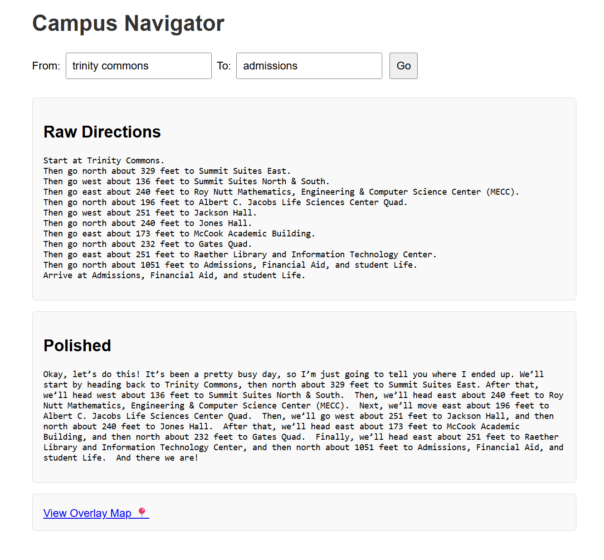

# CampusPath 
**Natural Language Navigation for College Campuses**

CampusPath is an interactive web-based application that allows users to request directions between buildings using natural language. It maps the request to real campus locations, computes the shortest walking route using a graph built from the campus map, and returns clear, human-like directions powered by a locally running LLM.

---

## 🌐 Features

- Fuzzy search of building names (handles typos or informal names)
- Natural paragraph-style directions using Ollama + Dolphin3/Gemma3
- Visual path overlay on your campus map
- Accurate feet-based distance calibration from your own measurements
- Fully local: no external APIs required
- Built using Python, Flask, NetworkX, OpenCV, and Ollama

---

## Project Structure

```

CampusPath/
├── data\_preparation/        # Processed graph, building coordinates
├── campus_nav/                     # Flask web app + LLM logic
├── .gitignore
├── requirements.txt         # Python dependencies
└── README.md

````

---

## Setup Instructions

### 1. Clone the Repository

```bash
git clone https://github.com/yourusername/CampusPath.git
cd CampusPath/app
````

### 2. Create Virtual Environment (WSL/Linux)

```bash
python3 -m venv venv
source venv/bin/activate
pip install -r ../requirements.txt
```

### 3. (Optional) Install Ollama Locally

Install [Ollama](https://ollama.com/) and pull your LLM:

```bash
ollama run gemma3:1b 
```

### 4. Run the App

```bash
python3 app.py
```

Then visit [http://localhost:5000](http://localhost:5000)

---

## How It Works

1. The user types: “How do I get from the library to the music building?”
2. The app uses fuzzy matching to find the closest building names.
3. It computes the shortest path on a graph extracted from a binarized map image.
4. The route is returned in:

   * Feet-based step-by-step directions
   * Human-readable paragraph (via LLM)
5. A PNG image is generated with the walking route overlayed on your real map.

---

## Screenshot

Here’s what the CampusPath experience looks like:

### 🔴 Route Overlay on Map


---

### 💬 Web Interface with Natural Directions



---

## Data Preparation

The `data_preparation/` folder includes:

* A high-res cleaned campus map
* A graph extracted using OpenCV + contour detection
* JSONs mapping building names to coordinates and to graph nodes
* The main processor script: `generate_directions_with_feet.py`

---

##  Development Notes

* Uses `rapidfuzz` or `fuzzywuzzy` for matching
* Uses `scipy.spatial.KDTree` for nearest-node snapping
* Tested on WSL with Python 3.10 and 3.12
* If Ollama is installed only in Windows, WSL calls it via PowerShell

---

## 🙋🏻‍♂️ Author

**Tarek Alsolame**
Computer Science graduate with a passion for intelligent systems and visual AI.
Built as an academic and portfolio project.

---

## 📄 License

MIT — free to use, modify, and build upon.
